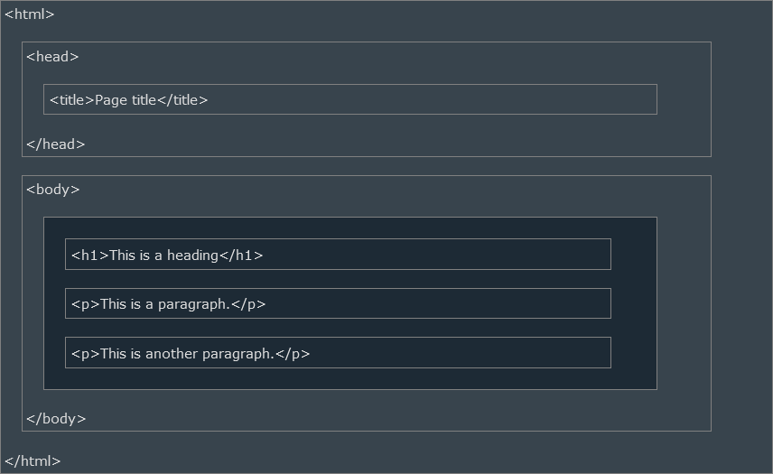

# Introduccion HTML

HTML es el lenguaje de marcado estándar para crear páginas web.

---

## ¿Qué es HTML?
- HTML significa Lenguaje de Marcado de HiperTexto
- HTML es el lenguaje de marcado estándar para crear páginas web
- HTML describe la estructura de una página web
- HTML consiste de una serie de elementos
- Los elementos HTML le dicen al navegador cómo mostrar el contenido
- Los elementos HTML etiquetan fragmentos de contenido como "esto es un encabezado", "esto es un párrafo", "esto es un enlace", etc.

---

## Un simple documento HTML

**Ejemplo**
```html
<!DOCTYPE html>
<html>
<head>
<title>Título Página</title>
</head>
<body>

<h1>Mi primer encabezado</h1>
<p>Mi primer párrafo.</p>

</body>
</html>
```

<button style="padding: 15px; background-color: #05a86e; border: none; border-radius: 5px; cursor: pointer;">
    <a href="https://www.w3schools.com/html/tryit.asp?filename=tryhtml_intro" style="color: white; text-decoration: none;" target="_blank">Prueba tú mismo</a>
</button>

### Ejemplo explicado
- La declaración `<!DOCTYPE html>` define que este documento es un documento HTML5
- El elemento `<html>` es el elemento raiz de una página HTML
- El elemento `<head>` contiene información meta sobre la página HTML
- El elemento `<title>` especifica un título para la página HTML (que se muestra en la barra de título del navegador o en la pestaña de la página)
- El elemento `<body>` define el cuerpo del documento y es un contenedor para todo el contenido visible, como encabezados, párrafos, imágenes, hipervínculos, tablas, listas, etc.
- El elemento `<h1>` define un encabezado grande
- El elemento `<p>` define un párrafo

---

## ¿Qué es un elemento HTML?
Un elemento HTML está definido por una etiqueta de inicio, algo de contenido y una etiqueta de cierre.

```html
<tagname>El contenido va aquí...</tagname>
```
El elemento HTML es todo, desde la etiqueta de inicio hasta la etiqueta de cierre.

```html
<h1>Mi primer encabezado</h1>
```
```html
<p>Mi primer párrafo.</p>
```

| Etiqueta de inicio    | Contenido del elemento               | Etiqueta de cierre |
|----------------|----------------------------|------------------------|
| `<h1>`         | Mi primer encabezado | `</h1>` |
| `<p>`   | Mi primer párrafo.        | `</p>` |
| `<br>`            | `none`     | `none`     |

>**Nota**: Algunos elementos HTML no tienen contenido (como el elemento `<br>`). Estos elementos son llamados elementos vacíos. Los elementos vacíos no tienen una etiqueta de cierre

---

## Navegadores web
El propósito de un navegador web (Chrome, Edge, Firefox, Safari) es leer documentos HTML y mostrarlos correctamente.

Un navegador no muestra las etiquetas HTML, pero las utiliza para determinar cómo mostrar el documento:


---

## Estructura página HTML

A continuación, se muestra una vista de la estructura de una página HTML:



>**Nota**: El contenido dentro de la sección `<body` se mostrará en un navegador. El contenido dentro del elemento `<title` se mostrará en la barra de título del navegador o en la pestaña de la página.

---

## Historia de HTML

Desde los primeros días de la World Wide Web, ha habido muchas versiones de HTML:

| Año  | Version                      |
|------|------------------------------|
| 1989 | Tim Berners Lee inventó WWW  |
| 1991 | Tim Berners Lee inventó HTML |
| 1993 | Dave Ragget escribió HTML+   |
| 1995 | El Grupo de Trabajo HTML definió HTML 2.0 |
| 1997 | La W3C recomienda: HTML 3.2 |
| 1999 | La W3C recomienda: HTML 4.01 |
| 2000 | La W3C recomienda: XHTML 1.0 |
| 2008 | La WHATWG publicó el pimer borrador de HTML5 |
| 2012 | La WHATWG convierte HTML5 en estándar |
| 2014 | La W3C recomienda: HTML5 |
| 2016 | La W3C recomienda como candidato: HTML 5.1 |
| 2017 | La W3C recomienda: HTML5.1 segunda edición |
| 2017 | La W3C recomienda: HTML5.2 |

> Este tutorial enseña la versión estándar más reciente de HTML5.

---

## Video: Introducción a HTML
<iframe width="560" height="315" src="https://www.youtube.com/embed/it1rTvBcfRg?si=YfDR4jYJbciBEUc4" title="YouTube video player" frameborder="0" allow="accelerometer; autoplay; clipboard-write; encrypted-media; gyroscope; picture-in-picture; web-share" referrerpolicy="strict-origin-when-cross-origin" allowfullscreen></iframe>